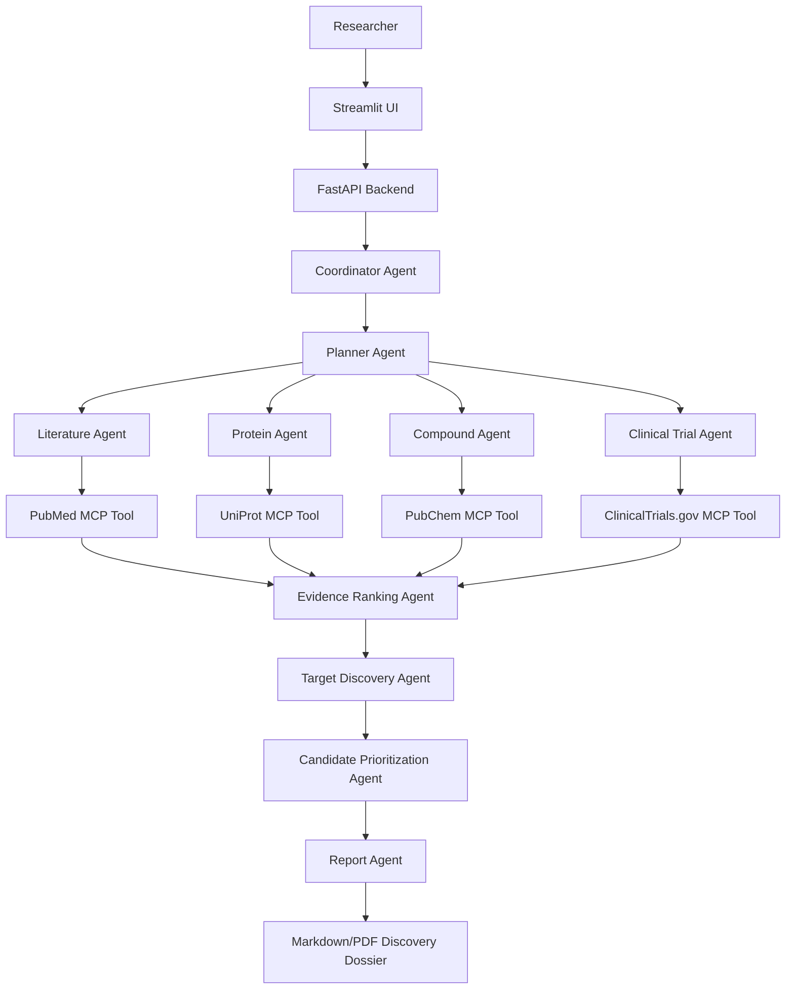

# PharmaGenie

PharmaGenie is an AI multi-agent in silico drug discovery platform for the Kaggle
**AI Agents: Intensive Vibe Coding Capstone** in the **Agents for Good** track.

It generates and prioritizes early-stage target and candidate hypotheses from
biomedical evidence. It does not validate efficacy, recommend treatment, provide
medical advice, or make patient-specific clinical decisions.

## Architecture



## Current Status

This repository contains a production-oriented runnable scaffold with:

- FastAPI backend
- Streamlit frontend
- Typed configuration and structured logging
- Safety and input validation controls
- Modular agent roles
- In silico target and candidate hypothesis generation
- MCP-style tool boundaries
- Mockable biomedical source clients
- Markdown/PDF report generation hooks
- pytest tests
- Docker and GitHub Actions CI
- Kaggle writeup and demo materials

The biomedical source clients attempt live retrieval from PubMed, UniProt,
PubChem, and ClinicalTrials.gov, with explicit fallback evidence when a source
is unavailable. The discovery workflow produces structured in silico hypotheses
from the retrieved evidence.

## Local Setup

```powershell
python -m venv .venv
.\.venv\Scripts\Activate.ps1
python -m pip install --upgrade pip
pip install -r requirements.txt
copy .env.example .env
pytest
```

Run the API:

```powershell
uvicorn pharmagenie.api.main:app --reload --host 0.0.0.0 --port 8080
```

Run the UI:

```powershell
streamlit run src/pharmagenie/ui/streamlit_app.py
```

## Sample Query

- Disease: `glioblastoma`
- Research goal: `Generate and prioritize in silico target and candidate hypotheses from biomedical evidence.`

## Safety

PharmaGenie rejects or redirects requests for patient-specific medical advice,
prompt injection, secret disclosure, and arbitrary code execution. Generated
candidates are labeled as hypotheses requiring experimental validation.
Retrieved source text is treated as untrusted evidence, not instructions.

## Roadmap

1. Install uv and agents-cli locally if you want to run official ADK evals.
2. Add a `GOOGLE_API_KEY` to activate Gemini synthesis instead of deterministic fallback.
3. Capture screenshots and demo video.
4. Deploy the FastAPI service to Cloud Run.

## Evaluation

Starter Agents CLI eval files live in [tests/eval](tests/eval). See
[docs/evaluation.md](docs/evaluation.md) for commands.
